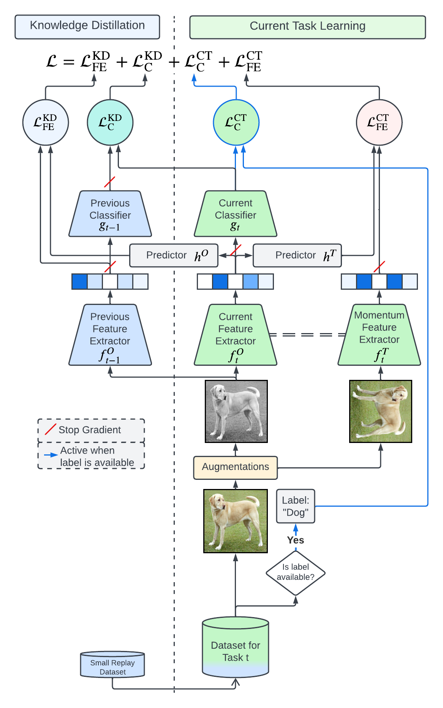
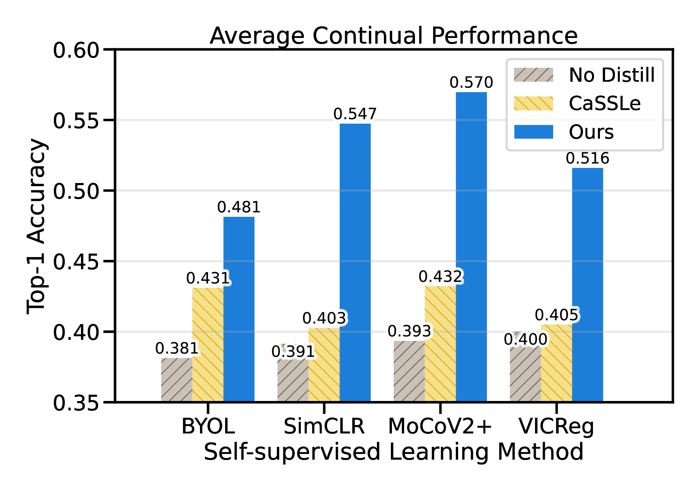
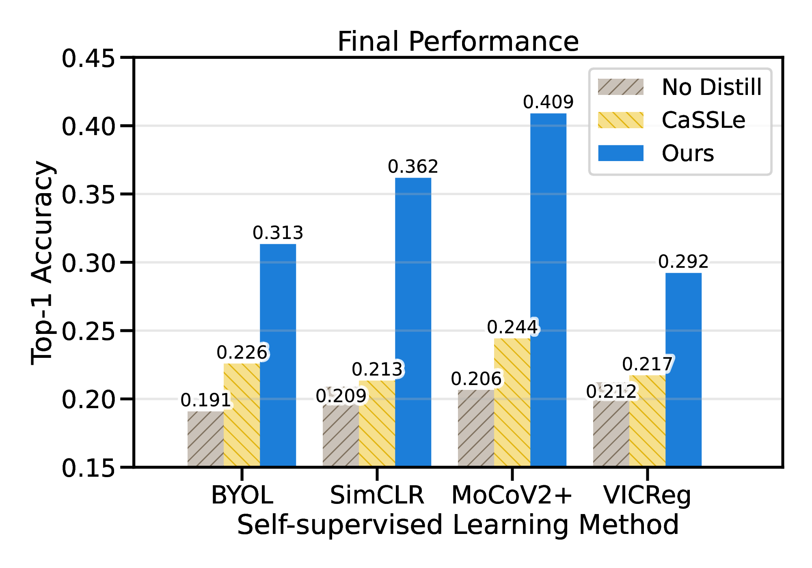

# Kaizen: Practical Self-Supervised Continual Learning With Continual Fine-Tuning

Official implementation of the algorithm outlined in
> **[Kaizen: Practical Self-Supervised Continual Learning With Continual Fine-Tuning](https://openaccess.thecvf.com/content/WACV2024/html/Tang_Kaizen_Practical_Self-Supervised_Continual_Learning_With_Continual_Fine-Tuning_WACV_2024_paper.html)**<br/>
> Chi Ian Tang, Lorena Qendro, Dimitris Spathis, Fahim Kawsar, Cecilia Mascolo, Akhil Mathur <br/>
> **WACV 2024**

> **Abstract:** *Self-supervised learning (SSL) has shown remarkable performance in computer vision tasks when trained offline. However, in a Continual Learning (CL) scenario where new data is introduced progressively, models still suffer from catastrophic forgetting. Retraining a model from scratch to adapt to newly generated data is time-consuming and inefficient. Previous approaches suggested re-purposing self-supervised objectives with knowledge distillation to mitigate forgetting across tasks, assuming that labels from all tasks are available during fine-tuning. In this paper, we generalize self-supervised continual learning in a practical setting where available labels can be leveraged in any step of the SSL process. With an increasing number of continual tasks, this offers more flexibility in the pre-training and fine-tuning phases. With Kaizen, we introduce a training architecture that is able to mitigate catastrophic forgetting for both the feature extractor and classifier with a carefully designed loss function. By using a set of comprehensive evaluation metrics reflecting different aspects of continual learning, we demonstrated that Kaizen significantly outperforms previous SSL models in competitive vision benchmarks, with up to 16.5% accuracy improvement on split CIFAR-100. Kaizen is able to balance the trade-off between knowledge retention and learning from new data with an end-to-end model, paving the way for practical deployment of continual learning systems.*





# Installation
Please run the following command to install the required packages:
```
pip install -r requirements.txt
```
In order to work with the [WandB](https://wandb.ai/site) logging library, you may need to run the following:
```
source setup_commands.sh
```

# Commands

Bash files for launching the experiments are provided in the `bash_files` folder. Using the `job_launcher.py` can launch experiments which automatically train a model continually for the number of tasks specified in the corresponding bash file.

For example, to launch the MoCoV2+ experiment, run:

```
DATA_DIR=/YOUR/DATA/DIR/ CUDA_VISIBLE_DEVICES=0 python job_launcher.py --script bash_files/mocov2plus_cifar_distill_classifier_l1000_soft_label_replay_0.01_b32.sh
```

Note that it is the default behaviour of each script to use gpu:0, so setting the `CUDA_VISIBLE_DEVICES=0` environment variable allows control over which gpu to be used by the script.

# Copyright, Acknowledgment & Warranty
This repository is provided for research reproducibility only. The authors reserve all rights. (Copyright (c) 2023 Chi Ian Tang, Lorena Qendro, Dimitris Spathis, Fahim Kawsar, Cecilia Mascolo, Akhil Mathur).

Part of this repository is based on the implementation of [cassle](https://github.com/DonkeyShot21/cassle) ([https://github.com/DonkeyShot21/cassle](https://github.com/DonkeyShot21/cassle)), used under the MIT License, Copyright (c) 2021 Enrico Fini, Victor Turrisi, Xavier Alameda-Pineda, Elisa Ricci, Karteek Alahari, Julien Mairal.

THE SOFTWARE IS PROVIDED "AS IS", WITHOUT WARRANTY OF ANY KIND, EXPRESS OR
    IMPLIED, INCLUDING BUT NOT LIMITED TO THE WARRANTIES OF MERCHANTABILITY,
    FITNESS FOR A PARTICULAR PURPOSE AND NONINFRINGEMENT. IN NO EVENT SHALL THE
    AUTHORS OR COPYRIGHT HOLDERS BE LIABLE FOR ANY CLAIM, DAMAGES OR OTHER
    LIABILITY, WHETHER IN AN ACTION OF CONTRACT, TORT OR OTHERWISE, ARISING FROM,
    OUT OF OR IN CONNECTION WITH THE SOFTWARE OR THE USE OR OTHER DEALINGS IN THE
    SOFTWARE.

# Citation

Please cite our paper if any part of this repository is used in any research work:
```
@inproceedings{tang2024kaizen,
  title={Kaizen: Practical Self-Supervised Continual Learning With Continual Fine-Tuning},
  author={Tang, Chi Ian and Qendro, Lorena and Spathis, Dimitris and Kawsar, Fahim and Mascolo, Cecilia and Mathur, Akhil},
  booktitle={Proceedings of the IEEE/CVF Winter Conference on Applications of Computer Vision},
  pages={2841--2850},
  year={2024}
}
```

# License

This project is licensed under the [BSD 3-Clause Clear License](LICENSE.md).
